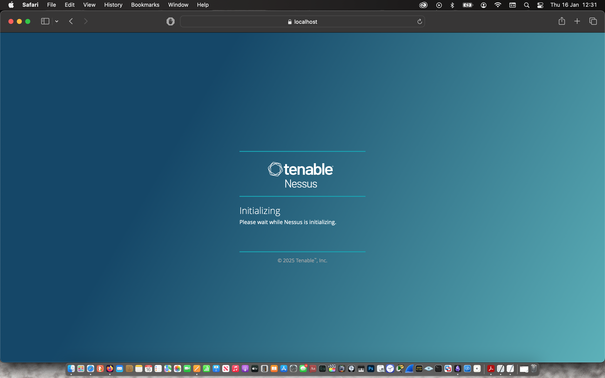

Text can be **bold**, _italic_, or ~~strikethrough~~.

After downloading the installer file from the Nessus website, I checked the file hashes against the hashes provided by the vendor.

I then double-clicked on the installer and followed the instructions as prompted.

 | 

 | 

 | 

The installer prompted the web application where I configured & registered for Nessus Essential.

 | 

 | 

 | 

Then I waited about 10 mins for the plugin to be compiled after which I manually updated the plugins.

To get started, I was prompted to launch a host discovery scan to identify my laptop.

