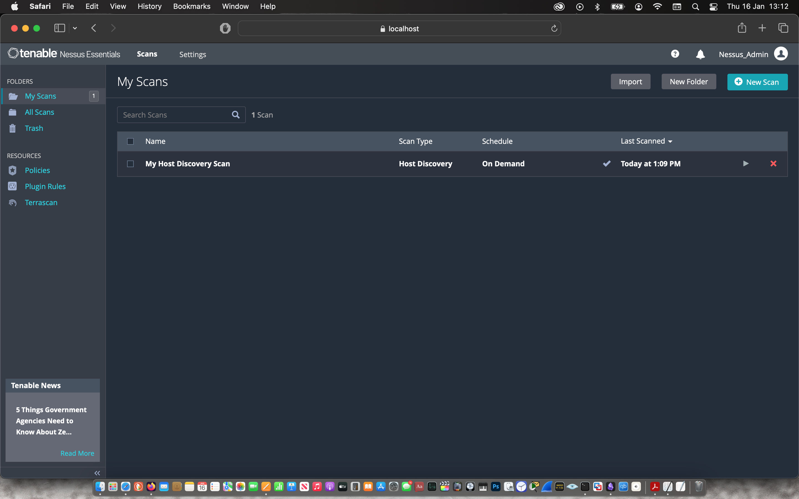
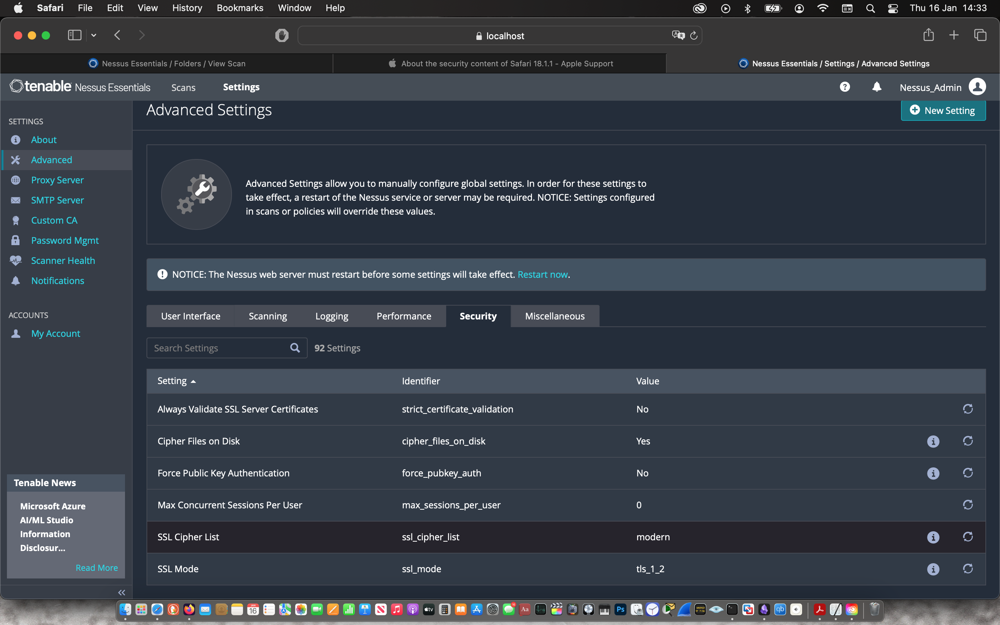

After downloading the installer file from the Nessus website, I checked the file hashes against the hashes provided by the vendor.

I then double-clicked on the installer and followed the instructions as prompted.

 | 

 | 

 | 

The installer prompted the web application where I configured & registered for Nessus Essential.

 | 

 | 

 | 

Then I waited about 10 mins for the plugin to be compiled after which I manually updated the plugins.

To get started, I was prompted to launch a host discovery scan to identify my laptop.

Then I started basic network scan that I named the “Maccy Mac Scan” with the target being my laptop. Under the “Assessment” tab, I changed the Scan Type to “Scan for all web vulnerabilities (quick)” before saving and starting the vulnerability scan.

 | 

 | 

 | 

The scan was ready after 16 mins.

Vulnerability Scan Result
*  Multiple vulnerabilities in the Adobe Photoshop application installed on the target
*  SSL Medium Strength Cipher Suites Supported in Nessus configuration

 | 

Remediation 1
*  Install Adobe Photoshop patch provided by the vendor

 | 

Remediation 2
Changed the Nessus configuration of the SSL Cipher List to only allow “NIAP Approved Ciphers”

 | 

Then I started another basic network scan that I named the “Maccy Mac Validation Scan” with the target being my laptop. Under the “Assessment” tab, I changed the Scan Type to “Scan for all web vulnerabilities (quick)” before saving and starting the vulnerability scan.

 | 

 | 

The scan was ready after 7 mins and the vulnerabilities were remediated.

 | 
